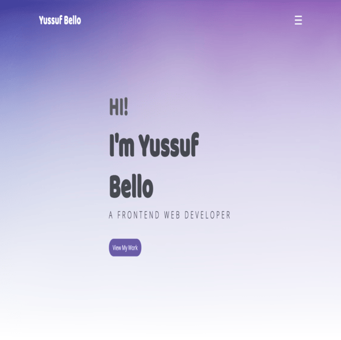

# Yussuf Bello Portfolio Website

[](https://yussufbello.com)
[](mailto:dbello447@gmail.com)



A clean, modern personal portfolio built to showcase Yussuf Bello’s skills, projects, and professional background as a Front-end Web Developer.

---

## 🌟 Introduction

**Yussuf Bello** is a creative and passionate Front-end Developer with over **5 years of experience**, skilled in building responsive and interactive UI using tools like React, Redux, Next.js, TypeScript, Sass, and more.

---

## 🔗 Live Demo

View the live site: [https://yussufbello.com](https://yussufbello.com)

---

## 💼 Portfolio Highlights

### 📌 Projects

- **Holiday Planning Website**  
  A tourism web app created for planning family vacations. Built with React, JavaScript, HTML5, CSS, and Git.

- **YB Portfolio Website**  
  Designed and developed personally to showcase skills, services, and past work. Built with JavaScript, HTML5, CSS, Sass, and Git.

---

## 🛠️ Technologies Used

- **Core**: React, JavaScript (ES6+), TypeScript, HTML5, CSS3, Sass, Git  
- **Frameworks & Tools**: Next.js, Redux, Bootstrap, Figma, jQuery, Firebase  
- **Design & UX**: Responsive design, component architecture, accessibility, performance optimisation, SEO

---

## 🧭 Features

- Professional landing page with hero section, about, portfolio, and contact  
- Expertise showcased: Front-end Development, UI/UX, SEO, performance tuning  
- Sections: About Me, Portfolio, Testimonials, Services, Contact  
- Social links to LinkedIn, GitHub, email, and downloadable CV

---

## 🚀 Installation & Local Setup

```bash
# Clone the repo
git clone https://github.com/bello-damy/portfolio
cd portfolio

# Install dependencies
npm install

# Run the development server
npm run dev
```

To build for production:

```bash
npm run build
npm run start
```

---

## 📂 Project Structure

```
├── public/
│   └── assets/
├── src/
│   ├── components/
│   ├── pages/
│   ├── styles/
│   └── App.js or index.jsx
├── .gitignore
├── package.json
├── README.md
└── LICENSE
```

---

## 📋 Environment Variables

Create a `.env` file and configure the following as needed:

```env
VITE_API_URL=https://api-url.com
VITE_API_KEY=apikey123
```

---

## 🎯 Roadmap

- [x] Launch personal portfolio site
- [ ] Add blog or case study section
- [ ] Improve mobile performance
- [ ] Add live chat or contact automation

---

## 👨‍💻 About Yussuf Bello

A results-driven Front-end Developer with hands-on experience collaborating across startups, academic institutions, and corporate teams. Skilled in building scalable, accessible, and maintainable web apps using modern front-end technologies and tools.

---

## 📞 Contact

- **Email**: [dbello447@gmail.com](mailto:dbello447@gmail.com)
- **Phone**: +44 7398 824903
- **Website**: [yussufbello.com](https://yussufbello.com)

---

## ⚖️ License

This project is licensed under the [MIT License](LICENSE).
